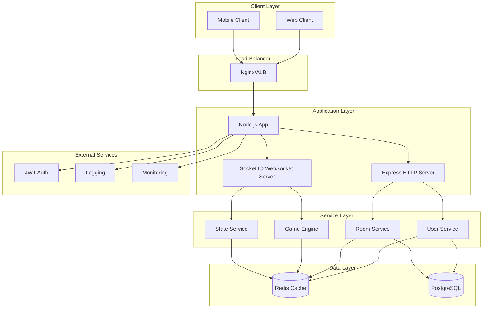
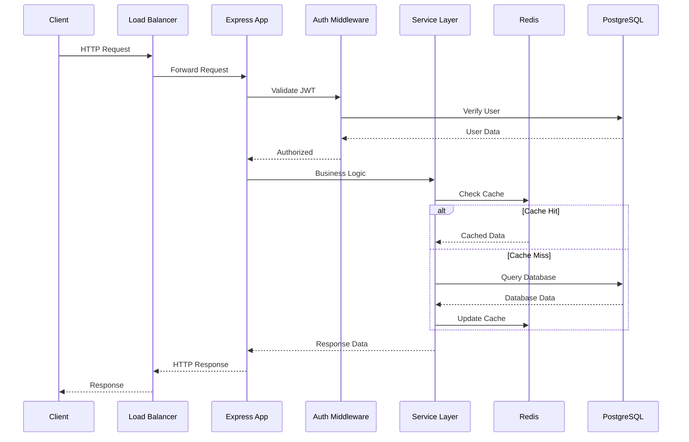
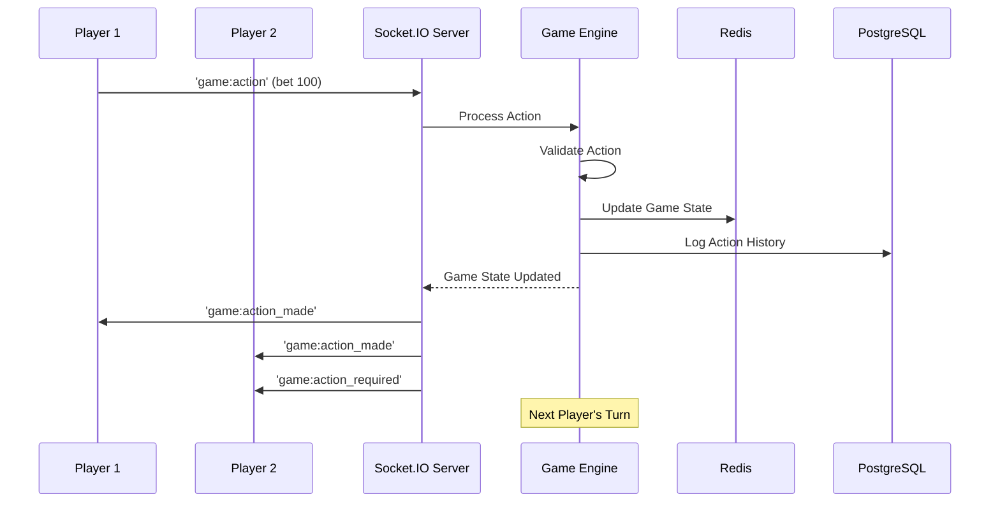

# Texas Poker Backend 技术设计文档

**版本**: 1.0  
**更新日期**: 2025-06-19  
**项目**: Texas Poker 多人实时德州扑克游戏后端  

---

## 📋 目录

- [1. 背景与目标](#1-背景与目标)
- [2. 架构概览](#2-架构概览)
- [3. 模块划分](#3-模块划分)
- [4. 数据流与请求流](#4-数据流与请求流)
- [5. 技术选型与理由](#5-技术选型与理由)
- [6. 非功能性需求](#6-非功能性需求)
- [7. 安全性设计](#7-安全性设计)

---

## 1. 背景与目标

### 1.1 系统要解决的问题

Texas Poker Backend 是一个**实时多人德州扑克游戏后端服务**，旨在解决以下核心问题：

- **实时多人游戏体验**: 支持多人同时在线的德州扑克游戏，提供毫秒级实时响应
- **复杂游戏逻辑管理**: 完整实现德州扑克规则，包括多轮下注、牌型判断、筹码分配
- **状态一致性保证**: 确保多个客户端之间游戏状态的强一致性
- **用户会话管理**: 处理用户注册、登录、房间管理等核心功能

### 1.2 设计目标

- **高可用性**: 99.9% 服务可用时间，支持优雅降级
- **低延迟**: WebSocket 事件响应时间 < 50ms，API 响应 < 200ms
- **高并发**: 支持 1000+ 并发连接，100+ 同时进行的游戏房间
- **强一致性**: 游戏状态在所有客户端保持严格一致
- **可扩展性**: 水平扩展能力，支持微服务架构演进

### 1.3 关键非功能性要求

| 需求类型 | 具体指标 | 实现策略 |
|---------|---------|---------|
| **性能** | API < 200ms, WebSocket < 50ms | Redis缓存 + 连接池优化 |
| **可用性** | 99.9% 可用时间 | 健康检查 + 自动重启 + 错误恢复 |
| **扩展性** | 支持水平扩展 | 无状态设计 + Redis 共享状态 |
| **一致性** | 强一致性游戏状态 | 事务 + 乐观锁 + 冲突检测 |
| **安全性** | JWT认证 + 数据验证 | 中间件验证 + 输入清洗 |

---

## 2. 架构概览

### 2.1 总体架构图



### 2.2 分层架构设计

```
┌─────────────────────────────────────┐
│        Presentation Layer           │  ← HTTP Routes + Socket Handlers
├─────────────────────────────────────┤
│         Control Layer               │  ← Request Validation + Auth
├─────────────────────────────────────┤
│       Business Logic Layer          │  ← Services + Game Engine
├─────────────────────────────────────┤
│        Data Access Layer            │  ← Prisma ORM + Redis Client
└─────────────────────────────────────┘
```

### 2.3 技术栈概览

| 层级 | 技术选择 | 版本 | 用途 |
|------|---------|------|------|
| **运行时** | Node.js | 18+ | JavaScript 运行环境 |
| **开发语言** | TypeScript | 5.0+ | 类型安全的开发语言 |
| **Web框架** | Express.js | 4.x | HTTP 服务器框架 |
| **实时通信** | Socket.IO | 4.x | WebSocket 实时通信 |
| **ORM** | Prisma | 5.x | 类型安全的数据库访问 |
| **主数据库** | PostgreSQL | 15+ | 事务性数据存储 |
| **缓存** | Redis | 7+ | 高性能键值存储 |
| **认证** | JWT + bcrypt | - | 无状态身份认证 |

---

## 3. 模块划分

### 3.1 HTTP REST API 模块 (`routes/`)

**职责边界**:
- 用户认证与授权 (`auth.ts`)
- 用户信息管理 (`user.ts`)  
- 房间CRUD操作 (`room.ts`)
- 系统健康检查 (`healthcheck.ts`)

**对外接口**:
```typescript
// 认证接口
POST /api/auth/register     // 用户注册
POST /api/auth/login        // 用户登录
POST /api/auth/refresh      // 刷新Token
POST /api/auth/logout       // 用户登出

// 用户接口
GET  /api/users/profile     // 获取用户信息
PUT  /api/users/profile     // 更新用户信息
GET  /api/users/stats       // 获取用户统计

// 房间接口
GET  /api/rooms             // 获取房间列表
POST /api/rooms             // 创建房间
GET  /api/rooms/:id         // 获取房间详情
PUT  /api/rooms/:id         // 更新房间设置
DELETE /api/rooms/:id       // 删除房间
```

### 3.2 WebSocket 实时通信模块 (`socket/`)

**职责边界**:
- 实时事件处理 (`handlers/`)
- 连接状态管理 (`socketServer.ts`)
- 消息验证中间件 (`middleware/validation.ts`)

**Socket事件接口**:
```typescript
// 房间事件
'room:join'           // 加入房间
'room:leave'          // 离开房间
'room:quick_start'    // 快速开始

// 游戏事件  
'game:action'         // 游戏操作
'game:ready'          // 准备游戏
'game:restart'        // 重新开始

// 系统事件
'ping'                // 心跳检测
'reconnect_attempt'   // 重连尝试
```

### 3.3 游戏引擎模块 (`game/`)

**职责边界**:
- 扑克牌逻辑 (`Card.ts`, `Deck.ts`)
- 游戏状态管理 (`GameState.ts`)
- 牌型判断算法 (`HandRank.ts`)
- 位置轮转管理 (`PositionManager.ts`)
- 筹码池计算 (`PotManager.ts`)

**核心算法**:
```typescript
// 游戏状态机
export enum GamePhase {
  WAITING = 'waiting',
  PREFLOP = 'preflop',
  FLOP = 'flop',
  TURN = 'turn', 
  RIVER = 'river',
  SHOWDOWN = 'showdown',
  ENDED = 'ended'
}

// 玩家操作类型
export enum PlayerActionType {
  FOLD = 'fold',
  CHECK = 'check',
  CALL = 'call',
  RAISE = 'raise',
  ALL_IN = 'allin'
}
```

### 3.4 业务服务模块 (`services/`)

**职责边界**:
- 用户状态服务 (`userStateService.ts`)
- 房间管理服务
- 游戏会话服务
- 数据同步服务

### 3.5 数据访问模块

**职责边界**:
- Prisma ORM 客户端 (`prisma.ts`)
- Redis 连接管理 (`db.ts`)
- 数据模型定义 (`prisma/schema.prisma`)

**数据模型设计**:
```prisma
model User {
  id        String   @id @default(cuid())
  username  String   @unique
  email     String   @unique
  password  String
  chips     Int      @default(1000)
  wins      Int      @default(0)
  losses    Int      @default(0)
  createdAt DateTime @default(now())
  updatedAt DateTime @updatedAt
  
  rooms     Room[]
  gameHistories GameHistory[]
}

model Room {
  id          String   @id @default(cuid())
  name        String
  ownerId     String
  maxPlayers  Int      @default(9)
  bigBlind    Int      @default(20)
  smallBlind  Int      @default(10)
  password    String?
  status      RoomStatus @default(WAITING)
  createdAt   DateTime @default(now())
  updatedAt   DateTime @updatedAt
  
  owner       User     @relation(fields: [ownerId], references: [id])
  gameHistories GameHistory[]
}
```

---

## 4. 数据流与请求流

### 4.1 用户请求链路



### 4.2 实时游戏数据流



### 4.3 缓存策略

**读取路径**:
```
Request → Redis Cache → PostgreSQL → Update Cache → Response
```

**写入路径**:
```
Request → Validate → PostgreSQL → Update Redis → Broadcast → Response
```

**缓存分层**:
- **L1 Cache**: 内存中的活跃游戏状态 (< 1s TTL)
- **L2 Cache**: Redis 中的用户会话和房间状态 (5min TTL)
- **L3 Storage**: PostgreSQL 中的持久化数据

---

## 5. 技术选型与理由

### 5.1 核心技术选型

#### **Node.js + TypeScript**
**选择理由**:
- **I/O密集型优势**: 德州扑克是I/O密集型应用，Node.js事件循环完美匹配
- **实时通信支持**: 原生支持WebSocket和长连接
- **类型安全**: TypeScript提供编译时类型检查，减少运行时错误
- **生态丰富**: 丰富的包生态，特别是Socket.IO等实时通信库

#### **Express.js + Socket.IO**
**选择理由**:
- **Express.js**: 轻量级、成熟稳定的HTTP框架
- **Socket.IO**: 业界标准的WebSocket库，支持自动降级和重连
- **双协议支持**: 同时支持HTTP REST API和WebSocket实时通信

#### **PostgreSQL + Prisma ORM**
**选择理由**:
- **PostgreSQL优势**:
  - ACID事务保证数据一致性
  - 丰富的数据类型支持(JSON, Arrays)
  - 优秀的并发控制和锁机制
  - 强大的查询优化器
- **Prisma优势**:
  - 类型安全的数据库访问
  - 自动生成类型定义
  - 迁移管理和数据库introspection
  - 优秀的查询构建器

#### **Redis**
**选择理由**:
- **高性能**: 内存存储，微秒级响应时间
- **丰富数据结构**: 支持String, Hash, List, Set等数据类型
- **发布订阅**: 支持实时消息广播
- **持久化选项**: 支持RDB和AOF持久化策略

### 5.2 架构模式选择

#### **分层架构 + 事件驱动**
**选择理由**:
- **分层架构**: 清晰的职责分离，便于维护和测试
- **事件驱动**: 适合实时游戏的异步特性
- **模块化设计**: 支持独立开发和部署

#### **状态管理策略**
**选择理由**:
- **无状态应用**: 支持水平扩展和负载均衡
- **外部状态存储**: Redis承担会话和实时状态存储
- **数据库持久化**: PostgreSQL保证数据持久性

---

## 6. 非功能性需求

### 6.1 性能要求

| 指标 | 目标值 | 实现方案 |
|------|--------|----------|
| **API响应时间** | < 200ms | Redis缓存 + 连接池 + 查询优化 |
| **WebSocket延迟** | < 50ms | 内存状态 + 事件循环优化 |
| **数据库查询** | < 100ms | 索引优化 + 查询优化 + 连接池 |
| **并发连接** | 1000+ | 事件驱动架构 + 连接复用 |
| **吞吐量** | 1000+ req/s | 异步处理 + 负载均衡 |

### 6.2 可靠性设计

**错误处理策略**:
```typescript
// 全局错误处理中间件
app.use((error: Error, req: Request, res: Response, next: NextFunction) => {
  logger.error('Unhandled error:', error);
  
  if (error instanceof ValidationError) {
    return res.status(400).json({ error: 'Invalid input' });
  }
  
  if (error instanceof AuthenticationError) {
    return res.status(401).json({ error: 'Authentication required' });
  }
  
  // 默认500错误
  res.status(500).json({ error: 'Internal server error' });
});
```

**健康检查机制**:
```typescript
// 健康检查端点
app.get('/health', async (req, res) => {
  const checks = {
    database: await checkDatabase(),
    redis: await checkRedis(),
    memory: process.memoryUsage(),
    uptime: process.uptime()
  };
  
  const isHealthy = checks.database && checks.redis;
  res.status(isHealthy ? 200 : 503).json(checks);
});
```

### 6.3 扩展性设计

**水平扩展支持**:
- 无状态应用设计
- Redis会话存储
- 数据库连接池
- 负载均衡器支持

**垂直扩展能力**:
- 内存使用优化
- CPU密集型任务优化
- I/O性能调优

---

## 7. 安全性设计

### 7.1 认证与授权

**JWT认证流程**:
```typescript
// JWT Token 生成
const generateToken = (user: User): string => {
  return jwt.sign(
    { 
      userId: user.id, 
      username: user.username,
      iat: Date.now() / 1000,
      exp: Date.now() / 1000 + 24 * 60 * 60 // 24小时过期
    },
    process.env.JWT_SECRET!,
    { algorithm: 'HS256' }
  );
};

// 认证中间件
const authenticateToken = async (req: Request, res: Response, next: NextFunction) => {
  const authHeader = req.headers['authorization'];
  const token = authHeader && authHeader.split(' ')[1];
  
  if (!token) {
    return res.status(401).json({ error: 'Access token required' });
  }
  
  try {
    const decoded = jwt.verify(token, process.env.JWT_SECRET!) as JwtPayload;
    const user = await prisma.user.findUnique({ where: { id: decoded.userId } });
    
    if (!user) {
      return res.status(401).json({ error: 'Invalid token' });
    }
    
    req.user = user;
    next();
  } catch (error) {
    return res.status(403).json({ error: 'Invalid or expired token' });
  }
};
```

### 7.2 输入验证与清洗

**数据验证中间件**:
```typescript
// Socket.IO 消息验证
const validateSocketMessage = (schema: z.ZodSchema) => {
  return (data: any, callback: Function) => {
    try {
      const validatedData = schema.parse(data);
      return validatedData;
    } catch (error) {
      callback({ success: false, error: 'Invalid message format' });
      return null;
    }
  };
};

// 游戏操作验证
const GameActionSchema = z.object({
  roomId: z.string().min(1),
  action: z.object({
    type: z.enum(['fold', 'check', 'call', 'raise', 'allin']),
    amount: z.number().min(0).optional()
  })
});
```

### 7.3 安全策略

**数据保护**:
- 密码使用bcrypt哈希存储
- 敏感数据加密传输(HTTPS/WSS)
- SQL注入防护(Prisma ORM)
- XSS防护(输入验证)

**访问控制**:
- 基于角色的权限控制
- 房间访问权限验证
- 操作权限检查

---

