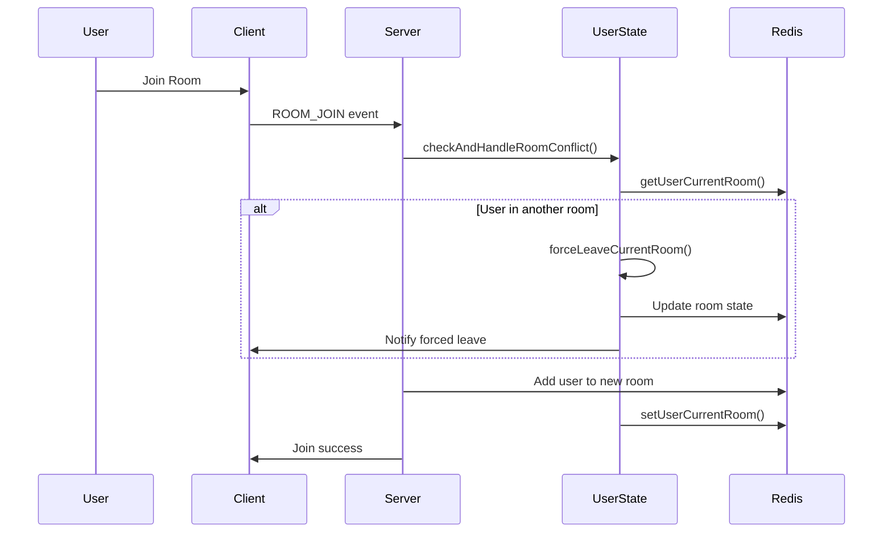
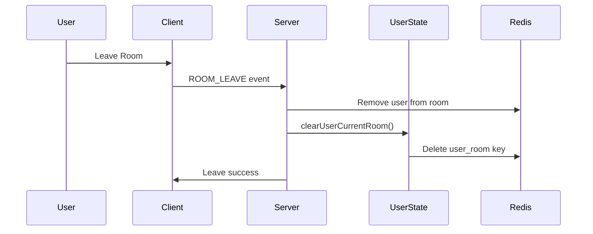

# User State Management System

## Overview

The User State Management System is designed to prevent users from being in multiple rooms simultaneously. This ensures game integrity and prevents potential cheating or exploitation.

## Features

### 1. Global User State Tracking
- Tracks which room each user is currently in
- Uses Redis for fast access and persistence
- Key format: `user_room:${userId}` -> `roomId`

### 2. Multi-Room Conflict Prevention
- Automatically detects when a user tries to join a room while already in another
- Forces the user to leave their current room before joining a new one
- Provides clear feedback to users about room changes

### 3. State Consistency
- Ensures consistency between global user state and room player lists
- Provides validation and cleanup mechanisms
- Handles edge cases like disconnections and errors

### 4. Administrative Tools
- Monitor user states across the system
- Debug state inconsistencies
- Manual cleanup and management

## Architecture

### UserStateService

The `UserStateService` is a singleton service that manages all user state operations:

```typescript
class UserStateService {
  // Core operations
  getUserCurrentRoom(userId: string): Promise<string | null>
  setUserCurrentRoom(userId: string, roomId: string): Promise<boolean>
  clearUserCurrentRoom(userId: string): Promise<boolean>
  
  // Conflict handling
  checkAndHandleRoomConflict(userId, targetRoomId, socket, io): Promise<...>
  forceLeaveCurrentRoom(userId, socket, io, reason): Promise<...>
  
  // Maintenance
  validateRoomStateConsistency(userId: string): Promise<...>
  cleanupOrphanedUserStates(): Promise<...>
}
```

### Integration Points

1. **Room Join (WebSocket)**
   - `ROOM_JOIN` event handler
   - `ROOM_QUICK_START` event handler
   - Reconnection logic

2. **Room Join (REST API)**
   - `/api/room/join` endpoint
   - `/api/room/create` endpoint

3. **Room Leave**
   - `ROOM_LEAVE` event handler
   - Disconnect handling
   - Room deletion

4. **Administrative API**
   - `/api/admin/user-states` - Monitor all user states
   - `/api/admin/user-states/:userId` - Get specific user state
   - `/api/admin/cleanup-orphaned-states` - Clean up invalid states
   - `/api/admin/room-consistency/:roomId` - Check room consistency

## Data Flow

### Joining a Room



### Leaving a Room



## Error Handling

### Common Scenarios

1. **Redis Connection Lost**
   - Graceful degradation
   - Returns false/null for state operations
   - Logs errors for monitoring

2. **State Inconsistency**
   - User references non-existent room
   - User not found in room player list
   - Automatic cleanup and correction

3. **Concurrent Operations**
   - Redis atomic operations
   - Proper error handling and rollback
   - State validation after operations

### Error Codes

- `FORCED_ROOM_LEAVE` - User was forced to leave a room
- Standard socket error codes for other scenarios

## Configuration

### Redis Keys

- `user_room:${userId}` - User's current room (expires after 1 hour)
- `room:${roomId}` - Room state (expires after 1 hour)

### Timeouts

- User state expiry: 3600 seconds (1 hour)
- Cleanup interval: 300 seconds (5 minutes)
- Reconnection grace period: Variable based on game state

## Monitoring

### Metrics to Track

1. **User State Operations**
   - Join/leave operations per minute
   - Forced leave events
   - State validation failures

2. **System Health**
   - Orphaned state count
   - Consistency check results
   - Redis operation success rate

3. **Performance**
   - Operation latency
   - Memory usage
   - Cleanup effectiveness

### Admin Endpoints

```bash
# Get all user states
GET /api/admin/user-states

# Get specific user state
GET /api/admin/user-states/:userId

# Check room consistency
GET /api/admin/room-consistency/:roomId

# Clean up orphaned states
POST /api/admin/cleanup-orphaned-states

# Force clear user state
DELETE /api/admin/user-states/:userId

# Get system statistics
GET /api/admin/stats
```

## Best Practices

### For Developers

1. **Always Update Global State**
   - Call `setUserCurrentRoom()` when user joins a room
   - Call `clearUserCurrentRoom()` when user leaves a room
   - Handle errors gracefully

2. **Check for Conflicts**
   - Use `checkAndHandleRoomConflict()` before joining
   - Provide clear user feedback
   - Log forced leave events

3. **Validate Consistency**
   - Periodically run consistency checks
   - Monitor orphaned states
   - Handle edge cases properly

### For Operators

1. **Monitor System Health**
   - Set up alerts for high orphaned state counts
   - Track forced leave frequency
   - Monitor Redis operation failures

2. **Regular Maintenance**
   - Run cleanup operations during low traffic
   - Review consistency reports
   - Monitor resource usage

## Future Enhancements

1. **Advanced Analytics**
   - User behavior tracking
   - Room switching patterns
   - Performance optimization

2. **Enhanced Conflict Resolution**
   - User preference handling
   - Graceful migration between rooms
   - Better UX for forced leaves

3. **Scalability Improvements**
   - Distributed state management
   - Cross-server synchronization
   - Load balancing considerations