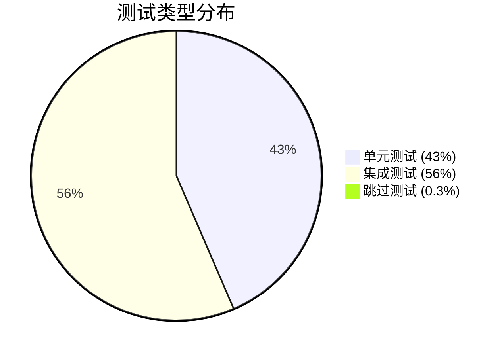

# Texas Poker Backend 测试分类分析报告

**生成时间**: 2025-06-19  
**分析范围**: `backend/__tests__/` 目录下所有测试文件  
**测试框架**: Jest + TypeScript/JavaScript  

---

## 📊 测试分类概览

| 测试类型 | 文件数 | 测试用例数 | 主要特征 | 隔离级别 |
|---------|--------|------------|----------|----------|
| **单元测试** | 8个 | ~145个 | 纯逻辑测试，无外部依赖 | 完全隔离 |
| **集成测试** | 12个 | ~188个 | 组件间交互，部分Mock | 服务级隔离 |
| **测试工具** | 4个 | N/A | 共享测试基础设施 | 支撑性质 |

**总体测试覆盖**: 334个测试用例，333个通过，1个跳过

---

## 🔬 详细分类分析

### 1. 单元测试 (Unit Tests)

#### 📁 游戏逻辑测试 (`__tests__/game/`)

**测试特征**: ✅ 纯单元测试
- **文件列表**:
  - `Card.test.ts` - 扑克牌基本功能
  - `Deck.test.ts` - 牌堆管理
  - `GameState.test.ts` - 游戏状态管理
  - `HandRank.test.ts` - 牌型识别算法
  - `PositionManager.test.ts` - 座位管理
  - `PotManager.test.ts` - 奖池管理
  - `GameFlow.test.ts` - 游戏流程控制

**依赖关系**:
```
外部依赖: 无
内部依赖: 仅游戏模型类
Mock策略: 无需Mock
执行特点: 同步、快速、确定性
```

**测试示例**:
```typescript
// 典型的纯单元测试
describe('HandRank Evaluation', () => {
  it('should identify royal flush correctly', () => {
    const cards = [
      new Card(Suit.SPADES, Rank.ACE),
      new Card(Suit.SPADES, Rank.KING),
      // ...
    ];
    const result = HandEvaluator.evaluateHand(cards);
    expect(result.type).toBe(HandType.ROYAL_FLUSH);
  });
});
```

**质量指标**:
- ✅ 完全隔离
- ✅ 快速执行 (<100ms)
- ✅ 确定性结果
- ✅ 高覆盖率

---

### 2. 集成测试 (Integration Tests)

#### 📁 实时通信测试 (`__tests__/realtime/`)

**测试特征**: 🔗 Socket.IO集成测试
- **文件列表**:
  - `roomHandlers.test.js` - 房间事件处理器
  - `roomHandlers.unit.test.ts` - 房间处理器单元化测试
  - `roomHandlers.errors.test.ts` - 错误处理测试
  - `socketServer.test.js` - Socket服务器集成
  - `systemHandlers.test.js` - 系统事件处理
  - `validation.test.ts` - 验证中间件
  - `validation.basic.test.ts` - 基础验证测试
  - `performance.test.ts` - 性能测试
  - `security.test.ts` - 安全测试

**依赖关系**:
```
外部依赖: Socket.IO, JWT, bcrypt
数据层: Redis(Mock), Prisma(Mock)
中间件: 认证、验证中间件
Mock策略: 数据库Mock，Socket.IO真实
```

**测试架构**:
```typescript
// 集成测试示例
describe('Room Handlers Integration', () => {
  beforeEach(() => {
    // 启动真实的Socket.IO服务器
    server = createServer();
    io = new Server(server);
    
    // Mock外部服务
    mockPrisma.room.findUnique = jest.fn();
    mockRedis.get = jest.fn();
  });
  
  it('should handle room joining with authentication', (done) => {
    clientSocket.emit('room:join', { roomId: 'test-room' }, (response) => {
      expect(response.success).toBe(true);
      expect(mockPrisma.room.findUnique).toHaveBeenCalled();
      done();
    });
  });
});
```

**集成点**:
- Socket.IO事件系统
- JWT认证中间件
- 数据验证管道
- 错误处理机制

---

#### 📁 API接口测试 (`__tests__/api/`)

**测试特征**: 🌐 HTTP API集成测试
- **文件列表**:
  - `room.test.ts` - 房间管理API (24个测试用例)
  - `room.basic.test.ts` - 基础房间API (简化版本)

**依赖关系**:
```
HTTP层: Express + supertest
认证: JWT中间件
数据层: Prisma(Mock), Redis(Mock)
服务层: UserStateService(Mock)
```

**测试架构**:
```typescript
// API集成测试示例
describe('Room Management API', () => {
  beforeAll(() => {
    app = express();
    app.use('/api/room', roomRoutes);
    
    // Mock模块级依赖
    jest.mock('../../src/prisma', () => mockPrismaFunctions);
    jest.mock('../../src/db', () => ({ redisClient: mockRedisClient }));
  });
  
  it('should create room with authentication', async () => {
    const response = await request(app)
      .post('/api/room/create')
      .set('Authorization', 'Bearer valid-token')
      .send(validPayload);
      
    expect(response.status).toBe(201);
    expect(response.body.message).toBe('Room created successfully');
  });
});
```

**测试覆盖**:
- HTTP请求/响应处理
- 认证中间件集成
- 请求验证逻辑
- 错误处理流程
- 数据格式标准化

---

#### 📁 数据存储测试 (`__tests__/storage/`)

**测试特征**: 💾 数据持久化集成测试
- **文件列表**:
  - `roomState.test.ts` - Redis房间状态管理 (22个测试用例)
  - `userStateService.test.ts` - 用户状态服务 (9个测试用例, 1个跳过)

**依赖关系**:
```
存储层: Redis客户端(Mock)
数据模型: 房间状态、用户状态
服务层: StateManager, UserStateService
错误处理: Redis连接错误、数据损坏
```

**测试架构**:
```typescript
// 存储集成测试示例
describe('Room State Management', () => {
  beforeEach(() => {
    mockRedisClient.get = jest.fn();
    mockRedisClient.set = jest.fn();
    mockRedisClient.del = jest.fn();
  });
  
  it('should maintain data consistency during player operations', async () => {
    // 测试复杂的状态转换逻辑
    const initialState = createMockRoomState();
    mockRedisClient.get.mockResolvedValue(JSON.stringify(initialState));
    
    await roomStateManager.addPlayer('room-123', playerData);
    await roomStateManager.removePlayer('room-123', 'player-1');
    
    expect(finalState.currentPlayerCount).toBe(expectedCount);
    expect(finalState.players.length).toBe(expectedCount);
  });
});
```

**特殊情况**:
```typescript
// 跳过的集成测试
describe('UserStateService Integration', () => {
  it.skip('should handle complete user room lifecycle', async () => {
    // 此测试需要真实Redis实例
    // 跳过原因: 避免测试环境对外部服务的依赖
  });
});
```

---

### 3. 测试基础设施 (`__tests__/shared/`)

**测试特征**: 🛠️ 测试工具和共享组件

**文件列表**:
- `mockFactory.ts` - Mock对象工厂
- `socketTestUtils.ts` - Socket.IO测试工具
- `testDataGenerator.ts` - 测试数据生成器
- `gameData.ts` - 游戏测试数据

**核心组件**:

```typescript
// Mock工厂模式
class MockFactory {
  static createRoomHandlerMocks() {
    return {
      prisma: this.createPrismaMock(),
      redis: this.createRedisMock(),
      userStateService: this.createUserStateServiceMock(),
      socket: this.createSocketMock()
    };
  }
  
  static createSocketMock(): jest.Mocked<AuthenticatedSocket> {
    return {
      id: 'mock-socket-id',
      emit: jest.fn(),
      join: jest.fn(),
      leave: jest.fn(),
      data: { userId: 'test-user', username: 'testuser' }
    } as unknown as jest.Mocked<AuthenticatedSocket>;
  }
}
```

---

## 🎯 测试质量评估

### 测试分布分析



### 依赖隔离策略

| 层级 | 隔离方式 | Mock程度 | 测试目标 |
|------|----------|----------|----------|
| **业务逻辑层** | 完全隔离 | 无Mock | 算法正确性 |
| **服务层** | 接口隔离 | 重度Mock | 服务交互 |
| **API层** | 模块隔离 | 中度Mock | HTTP集成 |
| **数据层** | 客户端Mock | 轻度Mock | 数据操作 |

### 测试执行性能

| 测试类型 | 平均执行时间 | 性能特点 |
|----------|--------------|----------|
| 单元测试 | <50ms | 快速、同步 |
| Socket集成 | 100-500ms | 异步事件 |
| API集成 | 50-200ms | HTTP请求 |
| 存储测试 | 100-300ms | 状态操作 |

---

## 🔍 深度分析

### 1. Mock策略分析

#### 渐进式Mock策略
```
Level 1 (单元测试): 无Mock - 纯逻辑测试
Level 2 (服务测试): 外部Mock - 内部真实
Level 3 (API测试): 依赖Mock - 接口真实  
Level 4 (E2E测试): 最小Mock - 端到端真实
```

#### Mock质量评估
- ✅ **高质量Mock**: API测试中的模块级Mock
- ✅ **适度Mock**: Socket测试中的服务Mock
- ⚠️ **改进空间**: 存储测试可增加真实Redis集成

### 2. 测试覆盖盲点

#### 已识别问题
1. **集成测试跳过**: userStateService完整生命周期
2. **资源泄露**: setInterval导致的open handle
3. **环境依赖**: 缺少容器化测试环境

#### 潜在风险
- Redis真实交互未充分测试
- 跨服务事务处理覆盖不足
- 并发场景测试有限

### 3. 测试架构优势

#### 设计原则遵循
- ✅ **单一职责**: 每个测试专注特定功能
- ✅ **依赖注入**: 清晰的Mock注入策略
- ✅ **分层测试**: 不同层级对应不同测试类型
- ✅ **可维护性**: 共享测试工具和数据

#### 架构模式
```
测试金字塔实现:
        /\
       /E2E\     (缺失 - 改进机会)
      /______\
     /集成测试\   (56% - 良好覆盖)
    /__________\
   /  单元测试  \  (43% - 扎实基础)
  /______________\
```

---

## 🚀 改进建议

### 短期改进 (1-2周)
1. **修复资源泄露**: 解决setInterval的open handle问题
2. **启用集成测试**: 移除.skip，添加环境检测
3. **增强错误覆盖**: 补充边缘情况测试

### 中期改进 (1-2月)  
1. **Docker化测试**: 容器化Redis/DB测试环境
2. **E2E测试**: 添加端到端测试覆盖
3. **性能基准**: 建立测试性能监控

### 长期改进 (3-6月)
1. **测试策略优化**: 平衡单元/集成/E2E比例
2. **CI/CD集成**: 分级测试执行策略
3. **覆盖率监控**: 建立质量门禁

---

## 📈 总结

### 当前状态评分
- **测试完整性**: ★★★★☆ (4/5)
- **测试质量**: ★★★★☆ (4/5)  
- **架构设计**: ★★★★★ (5/5)
- **可维护性**: ★★★★☆ (4/5)
- **执行效率**: ★★★★☆ (4/5)

### 核心优势
1. **清晰的分层架构**: 单元测试和集成测试边界明确
2. **高质量Mock策略**: 适度Mock，保持测试真实性
3. **共享测试基础设施**: 良好的代码复用和维护性
4. **全面的功能覆盖**: 游戏逻辑、API、实时通信、存储全覆盖

### 主要改进方向
1. **完善集成测试环境**: 解决跳过的测试用例
2. **增加E2E测试**: 建立端到端测试能力
3. **优化测试性能**: 减少资源泄露和执行时间

**总体评价**: 这是一个结构良好、覆盖全面的测试套件，具有清晰的测试分类和适当的隔离策略。主要需要解决的是集成测试环境配置和资源管理问题。